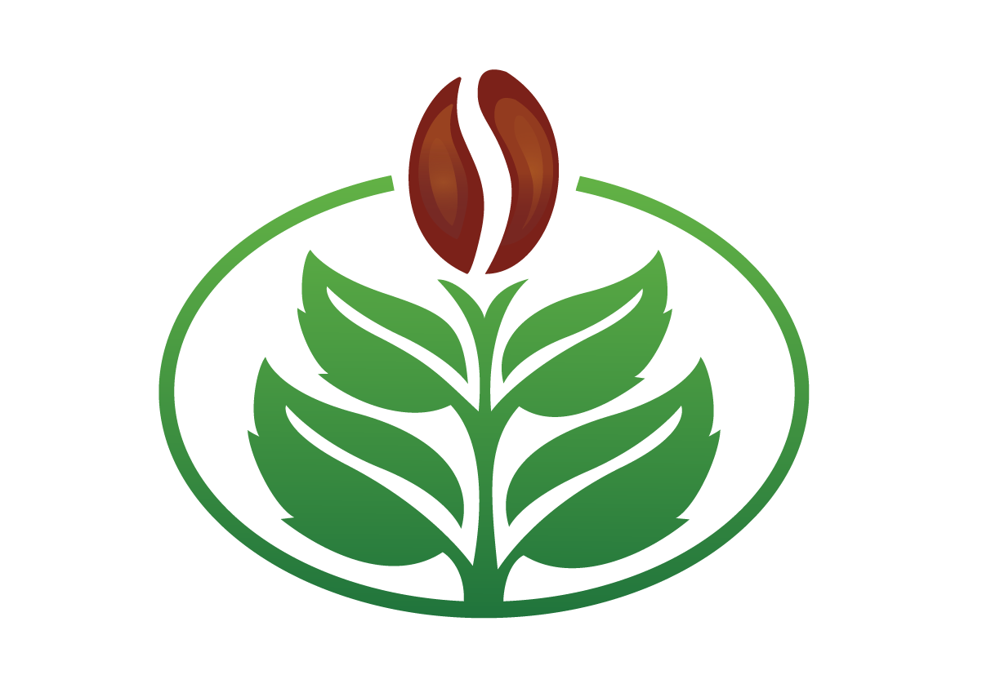

  <!-- Esta es la imagen del logo de Agrolink -->
  
   

  <h3><b>AgroLink</b></h3>

# 📗 Contenido

- [📖 Acerca del proyecto](#proyecto)
  - [🛠 Desarrollado con:](#desarrollo)
    - [Tech Stack](#tech-stack)
    - [Caracteristicas](#caracteristicas)
  - [🚀 Live Demo](#live-demo)
- [👥 Creadores](#creadores)
- [🔭 Caracteristicas Futuras](#caracteristicas-futuras)
- [⭐️ Muestranos tu apoyo](#apoyo)
- [🙏 Reconocimientos](#reconocimiento)
- [❓ Preguntas y Respuestas](#faq)
- [📝 Licencia](#license)

# 📖 AgroLink 

**AgroLink** Una plataforma confiable que conecta a los clientes, ofreciendo una experiencia de venta y compra sencilla, segura y personalizada; se le ofrese un alojamiento de sus productos, proporcionando a los socios un espacio para comprar tienendo un alcance a nivel nacional e internacional.

## 🛠 Desarrollado con: 

Como equipo, nuestro enfoque fue en desarrollar un website modelo Ecommerce, el cual permite tanto a los clientes como a los socios un facil acceso e interaccion entre ellos.

### Tech Stack 

  
Front-End

  <ul>
    <li><a href="https://html.com/">HTML/CSS</a></li>
    <li><a href="https://lenguajejs.com/">JavaScript</a></li>
    <li><a href="https://getbootstrap.com/">Boostrap</a></li>
  </ul>

  
Back-End

  <ul>
    <li><a href="https://nodejs.org/en">Node.js</a></li>
    <li><a href="https://expressjs.com/es/">Express JS</a></li>
  </ul>

  
Base de Datos

  <ul>
    <li><a href="https://www.mysql.com/">MySQL</a></li>
  </ul>

### Caracteristicas 

- **Facil registro de Socio y Cliente**
- **Transacciones seguras y rapidas dentro de la plataforma**
- **Informacion guardada con cifrado de extremo a extremo**

## 🚀 Live Demo 

El live demo estara disponible en X dias. 

<a href="">Demo</a>

## 👥 Creadores 

👤 **Cesar Rivera - Front-End Developer**

- GitHub: [@GitHub](https://github.com/MKZeika)
- X: [@Twitter](https://twitter.com/)
- Facebook: (https://www.facebook.com/ceduardornajera)

👤 **Reynaldo Castano - Back-End Developer**

- GitHub: [@GitHub](https://github.com/ReyAntonio12)
- X: [@Twitter](https://twitter.com/)
- Facebook: [Facebook](https://www.facebook.com/reycast1297)

👤 **Jackeline Lacayo - Marketing**

- GitHub: [@GitHub](https://github.com/Jacky2103)
- X: [@Twitter](https://twitter.com/)
- Facebook: [Facebook](https://www.facebook.com/msclacayo.cruz.9)

👤 **Jose Mendieta - Diseño UX**

- GitHub: [@GitHub](https://github.com/MRWHITEYEYEYE)
- X: [@Twitter](https://twitter.com/)
- Facebook: [Facebook](https://www.facebook.com/profile.php?id=100073410900642)

👤 **Javiera Expinoza - Marketing**

- GitHub: [@GitHub](https://github.com/)
- X: [@Twitter](https://twitter.com/)
- Facebook: [Facebook](https://www.facebook.com/anilorac.jc)

## 🔭 Caracteristicas Futuras 

Regresa pronto para no perderte ninguna actualizacion sobre este proyecto.

## ⭐️ Muestranos tu apoyo 

Si este proyecto fue de tu agrado y te gustaria colaborar para que pueda seguir creciendo porfavor marca una estrella a la par del nombre del repositorio.

Nos encantaria leer cualquier feedback o recomendacion en los comentarios.

## 🙏 Reconocimientos 

La realizacion de este proyecto fue inspirado por...

(Esta seccion no esta completa todavia, regresa en unos dias)

## ❓ Preguntas y Respuestas 

***¿Como me puedo registrar como socio?***
   
   R: Con tu correo electronico o numero de celular puedes crear una cuenta con nosotros.

***¿Me ayudan a impulsar mi negocio?***

   R: Si, como parte de tus beneficios de ser socio tendras publicidad dentro de nuestro sistema.

***¿Necesito tener redes sociales?***

   R: No, nuestra plataforma te ayuda a llegar a las personas adecuadas para ser tus futuros clientes.

## 📝 Licencia 

Este proyecto tiene una licencia personal (./licencia.md)

(<a href="#readme-top">regresar</a>)
